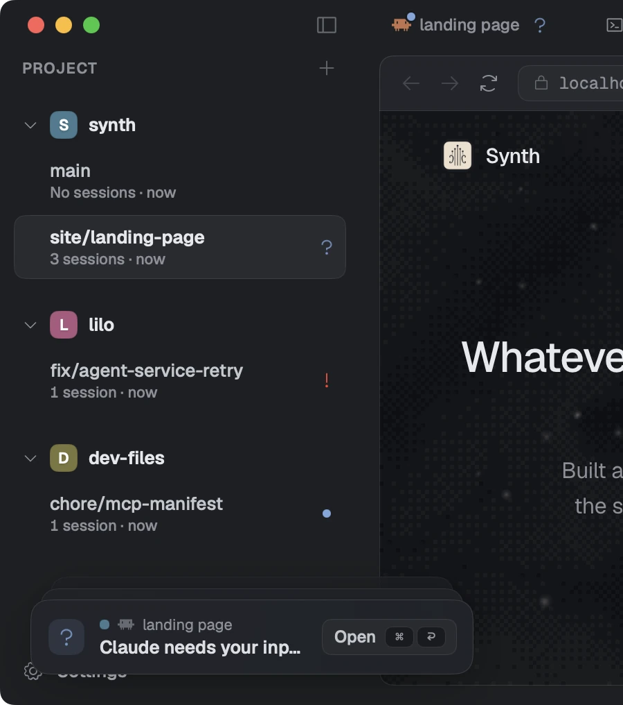

# Knowing who needs you

Every session carries a status, and a collapsed row carries the most urgent status inside it. That is what makes running several agents at once readable.

An agent thinking and an agent stuck waiting for you look identical in a terminal. Both are a cursor that is not moving. The only way to tell them apart is to go and look, and once you have four of them, going and looking is the whole job.

So every session in Synth reports what it is doing, and the sidebar reads it.

## The five states

|  |  |
|---|---|
| **Needs input** | The session has stopped and cannot go on until you answer it. A question, a permission decision, a prompt. The only state that is a request rather than a report. |
| **Error** | Something ended badly and nobody has looked at it yet. |
| **Busy** | Something is happening: an agent mid-turn, or a process that is up. One state, whether it is thinking or serving, because the row's icon already says which kind of thing it is. |
| **Unread** | It finished while you were elsewhere and you have not been back. |
| **Idle** | Nothing is happening and you have seen it. |

The indicators follow one grammar, so you can read a row you have never seen before:

- **A glyph asks for a person.** Needs input and error wear one.
- **A moving mark means live.** Busy is a sphere that beats.
- **A flat dot is ambient.** It is telling you, not asking you.

## What a collapsed row says

A collapsed branch or project shows the most urgent thing inside it, by this order:

```
needs input  >  error  >  busy  >  unread  >  idle
```

So a closed branch with four sessions inside it, one of which has stopped to ask you something, shows that it has stopped to ask you something. You do not have to open a branch to find out whether opening it was worth it.

A parent row could instead report only its own work, which would be honest and useless. The point of collapsing something is to stop looking at it, and a summary that can hide the one thing you needed is not doing the job.



*Each branch carries the state of what is inside it, so the tree is readable collapsed.*

## Notifications

Reading the sidebar means looking at Synth. When a session in the background changes state, Synth comes to you instead: a card in the deck at the bottom of the window, and a macOS notification as well when Synth is not the app you are in.

`⌘⏎` goes to whatever is at the front of the deck. That is the motion worth learning, because it means you never navigate to find the thing that wants you.

### Three kinds of card

|  |  |
|---|---|
| **Asking** | A question or a failure. Stays until you deal with it. |
| **Undoable** | Something you just did that can be taken back. It drains a bar along its bottom edge, and commits when the bar empties. |
| **Telling** | Something finished. It leaves on its own. |

The deck orders by what it costs to miss a card rather than by how bad the card sounds, so a ten-second-old question sits above a five-minute-old error you have already read in your head. Every card has a real button with its shortcut printed in it, and a close control that is not the same click as acting on it.

### Countdowns wait for you

A draining card only drains while you could actually be reading it. Hovering the deck pauses it, Synth being in the background pauses it, and a card folded under a *+N* is not counting down at all. An undo window that expired while you were in another app was never a window.

## Pull requests

Each branch row carries the state of its pull request beside the name: open, merged, closed, or waiting in the merge queue. The open session's header carries the number, and clicking it opens the pull request in your normal browser.

This is read with `gh`, so it needs the GitHub CLI to be installed and signed in. A repository that is not on GitHub, or a machine without `gh`, simply shows nothing.
