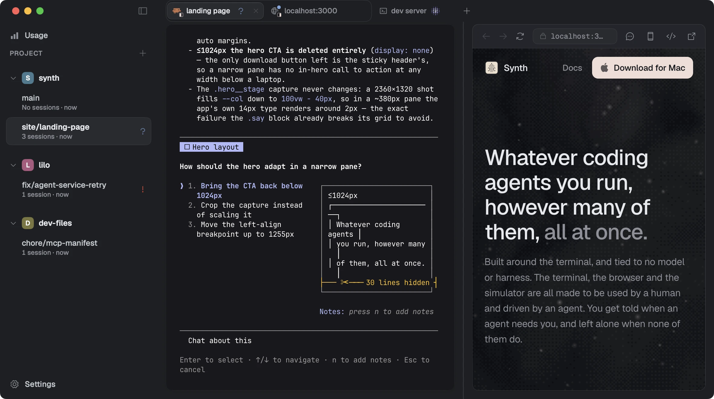

# Start here

Install Synth, point it at a repository, and get an agent working in its own branch. About five minutes, most of it the download.

## Before you start

Synth runs on macOS 14 or later, on Apple silicon. It is free, signed and notarised.

Bring at least one coding agent. Synth hosts [Claude Code, OpenCode and Antigravity](agents.md), and any agent you name yourself. It does not install them and it does not replace them: whichever ones are already on your PATH are the ones you will be offered.

> You do not need all three, or any particular one. If you have only Claude Code, Synth offers only Claude Code, and nothing about the rest of Synth changes.

## Install

Download the disk image, drag Synth to Applications, and open it.

[Download for Mac](https://synth-releases.fly.storage.tigris.dev/Synth.dmg)

Synth keeps itself up to date after that. When a new build is ready it downloads in the background and installs the next time you quit, so there is nothing to press. A **Restart to update** row appears at the foot of the sidebar while a downloaded build is waiting, and taking it only brings that install forward.

## Add a project

A **project** is one git repository. Press `⌘K` and choose **Add project**, or use the `+` on the sidebar header, and pick the repository's folder.

The folder has to be a git repository with at least one branch. A folder that cannot host a branch cannot host any work, so Synth refuses it at the picker rather than adding a row that does nothing. Pick a subdirectory of a repository and Synth resolves it to the repository root, so you get the project you already have rather than a second copy of it.

The project arrives with its default branch and nothing else. You add the branches you want one at a time.

## Make a branch

Press `⌘K` and choose **New branch**. Name it and press return.

Synth cuts a real [git worktree](branches.md) for it: a second checkout of the same repository, in its own folder, on its own branch. The branch you were on is untouched, and so is everything running in it.

## Start an agent

With the branch selected, press `⌘N` and pick an agent. It opens in the content pane and runs in that branch's checkout, so everything it reads and writes is that branch's copy of the code.

Ask it for something that takes a minute, then look at the sidebar rather than the pane. The row carries what the agent is doing, and you can leave the page entirely: Synth tells you when it stops and needs an answer. That is the part worth trying first, because it is the part a terminal cannot do.

*Three projects, several branches, and one agent that has stopped to ask something. The sidebar says which one without opening it.*

## Where to go next

- [How Synth is organised](concepts.md) is the one page to read if you read only one. Synth uses several words that your agent also uses, for different things.
- [Branches and worktrees](branches.md) covers what a new branch gets, what it does not get, and why your dependencies are not in it.
- [Knowing who needs you](attention.md) is the attention model, which is what makes running several agents at once survivable.
